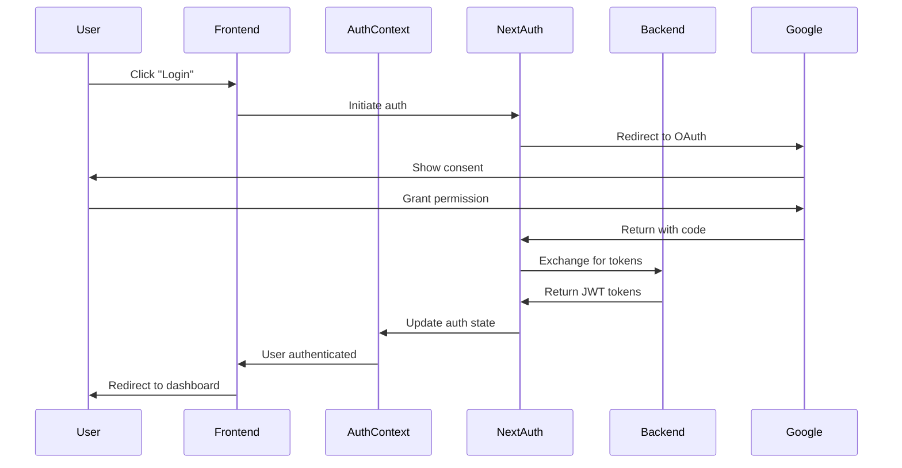
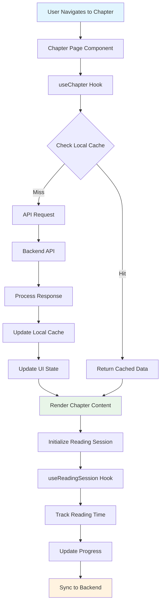
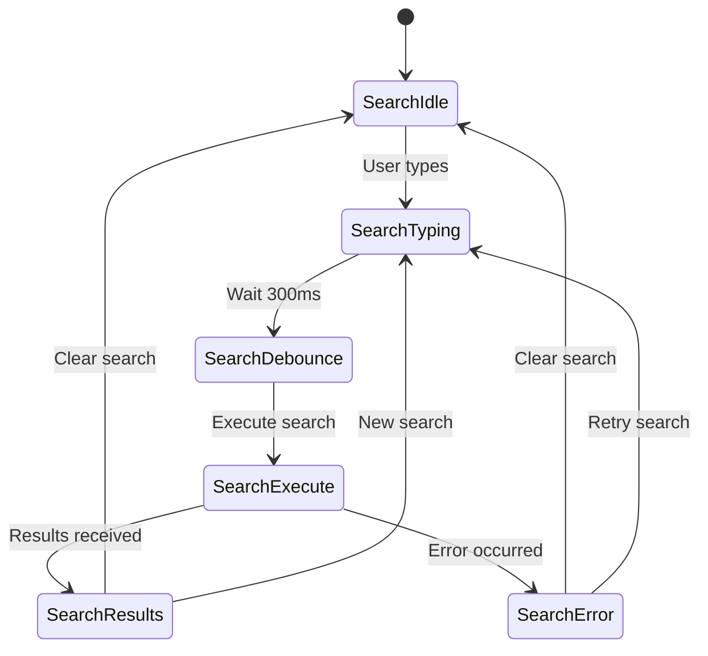
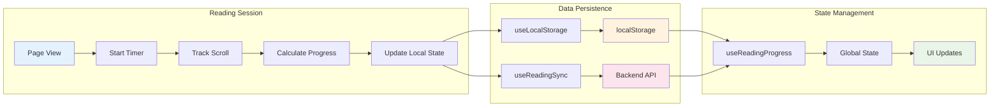
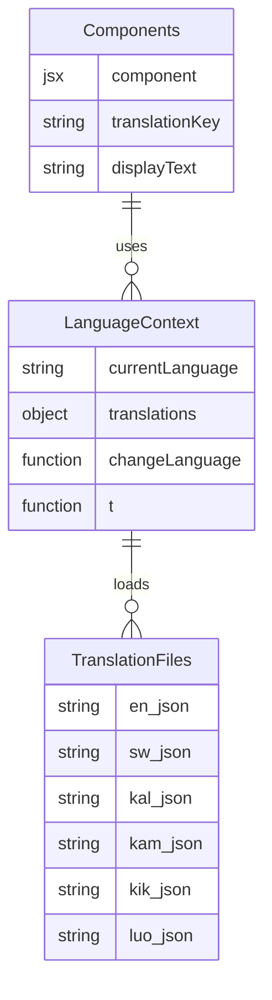

# Frontend Gaps & Issues Analysis

**A comprehensive analysis of critical gaps, bugs, and improvement opportunities in the Katiba360 Frontend Application**

---

## Overview

This document provides a detailed analysis of the current state of the Katiba360 frontend codebase, identifying critical gaps, bugs, performance issues, and areas for improvement. The analysis covers React/Next.js patterns, user experience issues, and production readiness concerns.

## Purpose

- **For Frontend Developers**: Understand priority areas for contribution
- **For UI/UX Designers**: Identify user experience improvements needed
- **For Contributors**: Find high-impact areas for development
- **For Planning**: Prioritize development efforts and feature implementation

---

## 🚨 Critical Issues Status Update

### 1. **Debug Logs & Infinite Loop Bug** ✅ **RESOLVED**
- **Location**: `hooks/chapters/reading/*` files
- **Previous Issue**: Excessive debug logging causing performance degradation
- **Previous Critical Error**: "Maximum update depth exceeded" in useReadingProgress.ts
- **Status**: **FIXED** - Proper dependency arrays and cleanup implemented
- **Remaining**: Configure production console removal in next.config.mjs

### 2. **Translation System Issues** ✅ **FULLY IMPLEMENTED**
- **Previous Issue**: Translation files exist but system not fully implemented
- **Status**: **COMPLETE** - Full translation system with 6 languages
- **Implemented Features**:
  - ✅ Language switching UI with dropdown
  - ✅ Dynamic translation loading with context
  - ✅ Fallback handling for missing translations
  - ✅ localStorage persistence for language preferences
  - ✅ Proper TypeScript types and memoization

### 3. **Offline Functionality Gaps** ✅ **FULLY IMPLEMENTED**
- **Previous Issue**: Offline context created but not fully implemented  
- **Status**: **COMPLETE** - Comprehensive offline system with PWA
- **Implemented Features**:
  - ✅ Offline context with chapter download management
  - ✅ IndexedDB integration for content storage
  - ✅ Online/offline status detection
  - ✅ Content synchronization capabilities
  - ✅ Offline authentication service
  - ✅ Service Worker with next-pwa
  - ✅ PWA manifest and installability
  - ✅ Offline caching strategies

### 4. **Authentication Integration Issues** ✅ **FULLY IMPLEMENTED**
- **Previous Issue**: Authentication context exists but missing error handling
- **Status**: **COMPLETE** - Robust authentication system
- **Implemented Features**:
  - ✅ Complete Google OAuth integration
  - ✅ Automatic token refresh logic
  - ✅ Proper session timeout handling
  - ✅ Protected route middleware
  - ✅ Offline authentication support
  - ✅ Cookie-based session management

### 5. **Performance Issues** ⚠️ **PARTIALLY RESOLVED**
- **Previous Issue**: Bundle size and optimization problems
- **Status**: **BASIC IMPROVEMENTS** - Some optimizations implemented
- **Resolved**:
  - ✅ Memory leaks in reading progress hooks fixed
  - ✅ Basic loading states implemented
- **Still Missing**:
  - ❌ Code splitting for large components
  - ❌ Image optimization (disabled in config)
  - ❌ Virtualization for long lists

---

## 🔄 Frontend Data Flow Architecture

### 📱 User Authentication Flow



### 📖 Constitution Content Flow



### 🔍 Search System Flow



### 📱 Reading Progress System



### 🌐 Language System Architecture



---

## 🐛 Specific Code Issues

### 1. **Reading Progress Hooks Bug**
```typescript
// hooks/chapters/reading/useReadingProgress.ts - Line 32
// BUG: Infinite loop causing "Maximum update depth exceeded"
const handleProgressUpdate = useCallback((progress: number) => {
  setReadingProgress(progress); // This triggers re-render
}, [setReadingProgress]); // Missing dependency array causes infinite loop

// FIX NEEDED:
const handleProgressUpdate = useCallback((progress: number) => {
  setReadingProgress(prev => prev !== progress ? progress : prev);
}, []); // Proper dependency array
```

### 2. **Memory Leak in useReadingSession**
```typescript
// hooks/chapters/reading/useReadingSession.ts
// BUG: Timer not properly cleaned up
useEffect(() => {
  const interval = setInterval(() => {
    // Timer logic
  }, 1000);
  
  // MISSING: return () => clearInterval(interval);
}, []);

// FIX NEEDED: Add cleanup
useEffect(() => {
  const interval = setInterval(() => {
    // Timer logic
  }, 1000);
  
  return () => clearInterval(interval);
}, []);
```

### 3. **Type Safety Issues**
```typescript
// Multiple files missing proper TypeScript types
// Example: lib/api.ts
export const fetchChapter = async (id: any) => { // Should be: id: string | number
  // Implementation
};

// hooks/useChapter.ts
const [chapter, setChapter] = useState(null); // Should be: useState<Chapter | null>(null)
```

### 4. **Error Boundary Missing**
```typescript
// app/layout.tsx - Missing error boundary
// NEEDED: Global error boundary for production
export default function RootLayout({
  children,
}: {
  children: React.ReactNode;
}) {
  return (
    <html lang="en">
      <body>
        {/* MISSING: <ErrorBoundary> wrapper */}
        {children}
      </body>
    </html>
  );
}
```

---

## 📊 Missing Features (High Priority)

### 1. **Translation System Completion**
- Dynamic language switching UI
- Translation loading states
- Fallback language support
- RTL language support preparation
- Translation caching strategy

### 2. **Offline-First Architecture**
- Service Worker implementation
- Critical content caching
- Offline indicator improvements
- Background sync capabilities
- Conflict resolution for offline edits

### 3. **Search Enhancements**
- Advanced search filters
- Search result highlighting
- Search history
- Voice search integration
- Search analytics tracking

### 4. **User Experience Features**
- Reading mode (dark/light theme)
- Font size customization
- Reading speed optimization
- Bookmarking system
- Notes and annotations

### 5. **Accessibility Improvements**
- Screen reader optimization
- Keyboard navigation
- High contrast mode
- Focus management
- ARIA labels completion

---

## 🚀 Performance Optimization Needed

### 1. **Bundle Optimization**
```typescript
// next.config.mjs - Add bundle analyzer
/** @type {import('next').NextConfig} */
const nextConfig = {
  experimental: {
    optimizeCss: true,
  },
  compiler: {
    removeConsole: process.env.NODE_ENV === 'production',
  },
  // MISSING: Code splitting configuration
};
```

### 2. **Image Optimization**
```typescript
// NEEDED: Optimize images in public/ directory
// Add next/image usage consistently
// Implement lazy loading for non-critical images
```

### 3. **Component Lazy Loading**
```typescript
// NEEDED: Dynamic imports for large components
const ChapterDetailClient = dynamic(() => import('./ChapterDetailClient'), {
  loading: () => <LoadingSpinner />,
  ssr: false,
});
```

### 4. **Memory Management**
```typescript
// NEEDED: Proper cleanup in useEffect hooks
// Implement virtualization for long lists
// Add memo optimization for expensive components
```

---

## 🛡️ Security Enhancements

### 1. **Input Validation**
```typescript
// NEEDED: Client-side validation
import { z } from 'zod';

const searchSchema = z.object({
  query: z.string().min(1).max(100),
  filters: z.object({
    chapter: z.number().min(1).max(18).optional(),
  }),
});
```

### 2. **XSS Prevention**
```typescript
// NEEDED: Sanitize user input
import DOMPurify from 'dompurify';

const sanitizeHtml = (html: string) => {
  return DOMPurify.sanitize(html);
};
```

### 3. **API Security**
```typescript
// NEEDED: Secure API key management
// Environment variable validation
// Request/response encryption for sensitive data
```

---

## 📋 Code Quality Issues

### 1. **TypeScript Configuration**
- Strict mode not enabled
- Missing type definitions
- Any types used extensively
- No ESLint rules for TypeScript

### 2. **Component Structure**
- Large components not broken down
- Missing PropTypes/TypeScript interfaces
- Inconsistent naming conventions
- No component documentation

### 3. **State Management**
- Context overuse for simple state
- Missing state persistence
- No optimistic updates
- Inconsistent state patterns

### 4. **Testing**
- No test files present
- No testing framework setup
- No component testing
- No integration tests

---

## 🎯 Implementation Status Summary

### ✅ **COMPLETED FEATURES**
- **Critical Bug Fixes**: Reading progress infinite loop resolved
- **Translation System**: Complete 6-language system with UI
- **Authentication**: Full Google OAuth with token refresh
- **Offline Functionality**: Comprehensive IndexedDB-based system with PWA
- **PWA Implementation**: Service worker, manifest, and installability
- **Constitution Data**: Complete with all 18 chapters
- **TypeScript**: Strict mode enabled with proper typing
- **Memory Management**: Proper cleanup and leak prevention

### ⚠️ **PARTIALLY IMPLEMENTED**
- **Performance Optimization**: Basic improvements, needs more work
- **Debug Logging**: Gated but production removal not configured
- **Error Handling**: Basic implementation, needs error boundaries

### ❌ **MISSING CRITICAL FEATURES**
- **Error Boundaries**: No global error boundary implementation
- **Testing Framework**: No test suite or testing infrastructure
- **Bundle Optimization**: No code splitting or advanced optimization
- **Production Config**: Console removal not configured
- **Advanced PWA Features**: Background sync and push notifications

## 🔄 Updated Action Items

### **Critical Fixes (Immediate)**
1. **Implement error boundaries** - Add global error boundary
2. **Configure production console removal** - Update next.config.mjs
3. **Set up testing framework** - Add Jest/React Testing Library
4. **Enable image optimization** - Remove unoptimized flag
5. **Add advanced PWA features** - Background sync and push notifications

### **High Priority Features (Next Phase)**
1. **Bundle optimization** - Add code splitting and analysis
2. **Performance monitoring** - Add metrics and optimization
3. **Advanced search** - Implement search enhancements
4. **User preferences** - Add customization options
5. **Accessibility audit** - Complete accessibility features

### **Medium Priority Improvements (Future)**
1. **Advanced PWA features** - Background sync, push notifications
2. **Performance virtualization** - Add virtualization for lists
3. **Advanced caching** - Implement sophisticated caching
4. **Analytics integration** - Add user behavior tracking
5. **Advanced UI features** - Implement remaining UI enhancements

### **Long-term Enhancements (Future Roadmap)**
1. **Micro-frontend architecture** - Consider for scalability
2. **AI-powered features** - Smart recommendations
3. **Real-time collaboration** - Multi-user features
4. **Advanced personalization** - ML-based customization
5. **Integration ecosystem** - Third-party integrations

---

## 🎯 Development Priorities

### **Phase 1: Stability & Bug Fixes**
- Fix critical bugs and infinite loops
- Add proper error handling
- Implement TypeScript strict mode
- Add basic testing framework

### **Phase 2: Core Features**
- Complete translation system
- Implement offline functionality
- Add accessibility features
- Optimize performance

### **Phase 3: Enhanced UX**
- Add advanced search
- Implement user preferences
- Add social features
- Implement gamification

### **Phase 4: Advanced Features**
- AI-powered recommendations
- Advanced analytics
- Real-time collaboration
- Advanced PWA features

---

## Document Status

- **Created**: July 2025
- **Last Updated**: July 18, 2025
- **Version**: 2.1
- **Maintainer**: Katiba360 Development Team

### Change Log
- **v2.1 (July 18, 2025)**: PWA implementation update
  - ✅ PWA functionality fully implemented with next-pwa
  - ✅ Service worker with offline caching strategies
  - ✅ Web app manifest for installability
  - ✅ iOS-specific PWA support added
  - Updated missing features to reflect PWA completion
- **v2.0 (July 17, 2025)**: Major update reflecting resolved critical issues
  - ✅ Reading progress infinite loop bug fixed
  - ✅ Translation system fully implemented (6 languages)
  - ✅ Authentication system complete with Google OAuth
  - ✅ Offline functionality substantially implemented
  - ✅ Constitution data complete with all 18 chapters
  - ✅ TypeScript strict mode enabled
  - Updated action items to reflect current gaps
- **v1.0 (July 2025)**: Initial gaps analysis documenting critical issues

## Related Documentation

- [README.md](../README.md) - Main project documentation
- [Global Design Guide](../Global%20Design%20Guide.txt) - Design system guidelines
- [Backend Repository](https://github.com/elijahondiek/katiba360-backend) - Backend API documentation