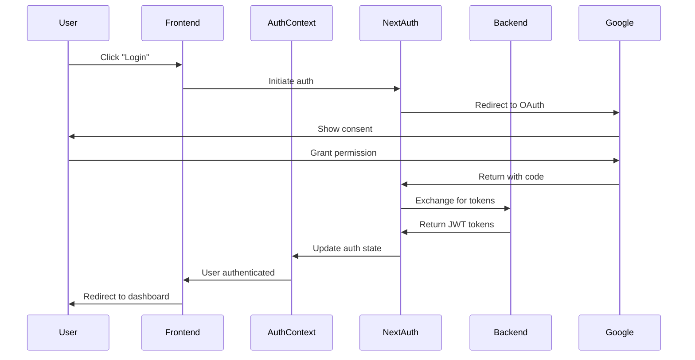
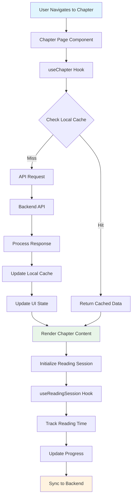
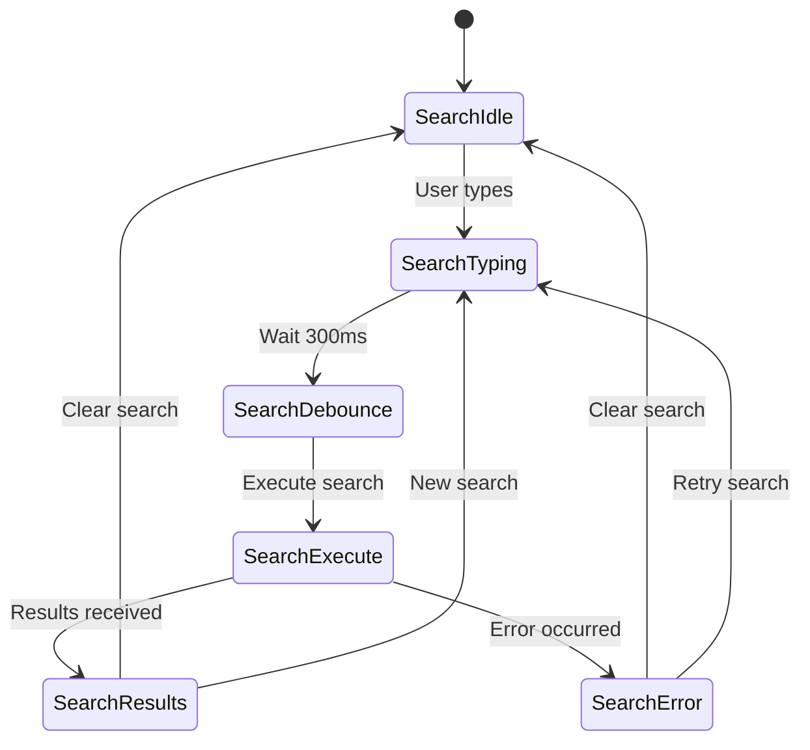
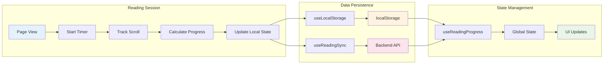
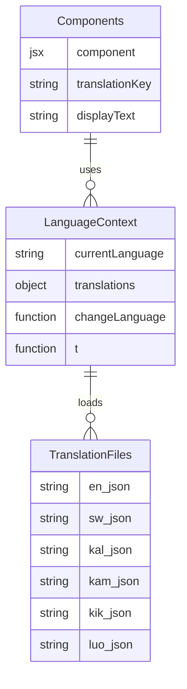

# Frontend Gaps & Issues Analysis

**A comprehensive analysis of critical gaps, bugs, and improvement opportunities in the Katiba360 Frontend Application**

---

## Overview

This document provides a detailed analysis of the current state of the Katiba360 frontend codebase, identifying critical gaps, bugs, performance issues, and areas for improvement. The analysis covers React/Next.js patterns, user experience issues, and production readiness concerns.

## Purpose

- **For Frontend Developers**: Understand priority areas for contribution
- **For UI/UX Designers**: Identify user experience improvements needed
- **For Contributors**: Find high-impact areas for development
- **For Planning**: Prioritize development efforts and feature implementation

---

## 🚨 Critical Issues Identified

### 1. **Debug Logs & Infinite Loop Bug**
- **Location**: `hooks/chapters/reading/*` files
- **Issue**: Excessive debug logging causing performance degradation
- **Critical Error**: "Maximum update depth exceeded" in useReadingProgress.ts
- **Impact**: App crashes and poor user experience

### 2. **Translation System Issues**
- **Incomplete Integration**: Translation files exist but system not fully implemented
- **Missing Features**: No language switching UI for local dialects
- **No Dynamic Loading**: All translations loaded at once
- **Missing Fallbacks**: No fallback handling for missing translations

### 3. **Offline Functionality Gaps**
- **Context Exists**: Offline context created but not fully implemented
- **No Service Worker**: Missing PWA capabilities
- **No Content Caching**: Critical constitution content not cached
- **No Sync Strategy**: No offline/online synchronization

### 4. **Authentication Integration Issues**
- **Incomplete Flow**: Authentication context exists but missing error handling
- **No Token Refresh**: Missing automatic token refresh logic
- **Session Management**: No proper session timeout handling
- **Protected Routes**: Incomplete route protection implementation

### 5. **Performance Issues**
- **Bundle Size**: No code splitting for large components
- **Image Optimization**: Images not optimized for web
- **Memory Leaks**: Potential memory leaks in reading progress hooks
- **No Virtualization**: Long lists not virtualized

---

## 🔄 Frontend Data Flow Architecture

### 📱 User Authentication Flow



### 📖 Constitution Content Flow



### 🔍 Search System Flow



### 📱 Reading Progress System



### 🌐 Language System Architecture



---

## 🐛 Specific Code Issues

### 1. **Reading Progress Hooks Bug**
```typescript
// hooks/chapters/reading/useReadingProgress.ts - Line 32
// BUG: Infinite loop causing "Maximum update depth exceeded"
const handleProgressUpdate = useCallback((progress: number) => {
  setReadingProgress(progress); // This triggers re-render
}, [setReadingProgress]); // Missing dependency array causes infinite loop

// FIX NEEDED:
const handleProgressUpdate = useCallback((progress: number) => {
  setReadingProgress(prev => prev !== progress ? progress : prev);
}, []); // Proper dependency array
```

### 2. **Memory Leak in useReadingSession**
```typescript
// hooks/chapters/reading/useReadingSession.ts
// BUG: Timer not properly cleaned up
useEffect(() => {
  const interval = setInterval(() => {
    // Timer logic
  }, 1000);
  
  // MISSING: return () => clearInterval(interval);
}, []);

// FIX NEEDED: Add cleanup
useEffect(() => {
  const interval = setInterval(() => {
    // Timer logic
  }, 1000);
  
  return () => clearInterval(interval);
}, []);
```

### 3. **Type Safety Issues**
```typescript
// Multiple files missing proper TypeScript types
// Example: lib/api.ts
export const fetchChapter = async (id: any) => { // Should be: id: string | number
  // Implementation
};

// hooks/useChapter.ts
const [chapter, setChapter] = useState(null); // Should be: useState<Chapter | null>(null)
```

### 4. **Error Boundary Missing**
```typescript
// app/layout.tsx - Missing error boundary
// NEEDED: Global error boundary for production
export default function RootLayout({
  children,
}: {
  children: React.ReactNode;
}) {
  return (
    <html lang="en">
      <body>
        {/* MISSING: <ErrorBoundary> wrapper */}
        {children}
      </body>
    </html>
  );
}
```

---

## 📊 Missing Features (High Priority)

### 1. **Translation System Completion**
- Dynamic language switching UI
- Translation loading states
- Fallback language support
- RTL language support preparation
- Translation caching strategy

### 2. **Offline-First Architecture**
- Service Worker implementation
- Critical content caching
- Offline indicator improvements
- Background sync capabilities
- Conflict resolution for offline edits

### 3. **Search Enhancements**
- Advanced search filters
- Search result highlighting
- Search history
- Voice search integration
- Search analytics tracking

### 4. **User Experience Features**
- Reading mode (dark/light theme)
- Font size customization
- Reading speed optimization
- Bookmarking system
- Notes and annotations

### 5. **Accessibility Improvements**
- Screen reader optimization
- Keyboard navigation
- High contrast mode
- Focus management
- ARIA labels completion

---

## 🚀 Performance Optimization Needed

### 1. **Bundle Optimization**
```typescript
// next.config.mjs - Add bundle analyzer
/** @type {import('next').NextConfig} */
const nextConfig = {
  experimental: {
    optimizeCss: true,
  },
  compiler: {
    removeConsole: process.env.NODE_ENV === 'production',
  },
  // MISSING: Code splitting configuration
};
```

### 2. **Image Optimization**
```typescript
// NEEDED: Optimize images in public/ directory
// Add next/image usage consistently
// Implement lazy loading for non-critical images
```

### 3. **Component Lazy Loading**
```typescript
// NEEDED: Dynamic imports for large components
const ChapterDetailClient = dynamic(() => import('./ChapterDetailClient'), {
  loading: () => <LoadingSpinner />,
  ssr: false,
});
```

### 4. **Memory Management**
```typescript
// NEEDED: Proper cleanup in useEffect hooks
// Implement virtualization for long lists
// Add memo optimization for expensive components
```

---

## 🛡️ Security Enhancements

### 1. **Input Validation**
```typescript
// NEEDED: Client-side validation
import { z } from 'zod';

const searchSchema = z.object({
  query: z.string().min(1).max(100),
  filters: z.object({
    chapter: z.number().min(1).max(18).optional(),
  }),
});
```

### 2. **XSS Prevention**
```typescript
// NEEDED: Sanitize user input
import DOMPurify from 'dompurify';

const sanitizeHtml = (html: string) => {
  return DOMPurify.sanitize(html);
};
```

### 3. **API Security**
```typescript
// NEEDED: Secure API key management
// Environment variable validation
// Request/response encryption for sensitive data
```

---

## 📋 Code Quality Issues

### 1. **TypeScript Configuration**
- Strict mode not enabled
- Missing type definitions
- Any types used extensively
- No ESLint rules for TypeScript

### 2. **Component Structure**
- Large components not broken down
- Missing PropTypes/TypeScript interfaces
- Inconsistent naming conventions
- No component documentation

### 3. **State Management**
- Context overuse for simple state
- Missing state persistence
- No optimistic updates
- Inconsistent state patterns

### 4. **Testing**
- No test files present
- No testing framework setup
- No component testing
- No integration tests

---

## 🔄 Immediate Action Items

### **Critical Fixes (Week 1)**
1. **Fix reading progress infinite loop bug**
2. **Remove debug logs from production**
3. **Add proper TypeScript types**
4. **Implement error boundaries**
5. **Fix memory leaks in hooks**

### **High Priority Features (Week 2-3)**
1. **Complete translation system integration**
2. **Implement offline functionality**
3. **Add comprehensive error handling**
4. **Optimize bundle size and performance**
5. **Add accessibility features**

### **Medium Priority Improvements (Week 4-5)**
1. **Add comprehensive testing suite**
2. **Implement search enhancements**
3. **Add user preference system**
4. **Implement caching strategy**
5. **Add monitoring and analytics**

### **Long-term Enhancements (Month 2+)**
1. **Implement PWA capabilities**
2. **Add advanced user features**
3. **Implement micro-frontend architecture**
4. **Add advanced analytics**
5. **Implement AI-powered features**

---

## 🎯 Development Priorities

### **Phase 1: Stability & Bug Fixes**
- Fix critical bugs and infinite loops
- Add proper error handling
- Implement TypeScript strict mode
- Add basic testing framework

### **Phase 2: Core Features**
- Complete translation system
- Implement offline functionality
- Add accessibility features
- Optimize performance

### **Phase 3: Enhanced UX**
- Add advanced search
- Implement user preferences
- Add social features
- Implement gamification

### **Phase 4: Advanced Features**
- AI-powered recommendations
- Advanced analytics
- Real-time collaboration
- Advanced PWA features

---

## Document Status

- **Created**: [Current Date]
- **Last Updated**: [Current Date]
- **Version**: 1.0
- **Maintainer**: Katiba360 Development Team

## Related Documentation

- [README.md](../README.md) - Main project documentation
- [Global Design Guide](../Global%20Design%20Guide.txt) - Design system guidelines
- [Backend Repository](https://github.com/elijahondiek/katiba360-backend) - Backend API documentation